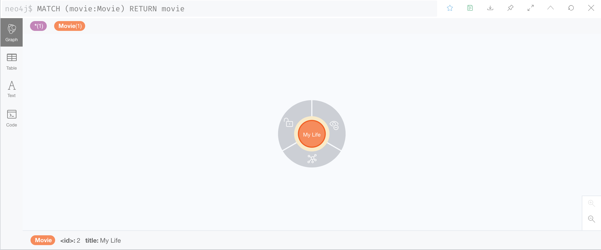
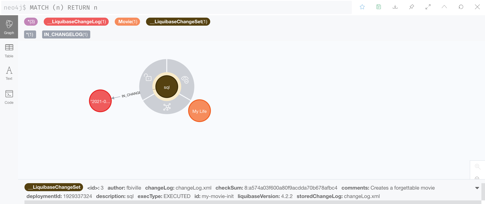

# Neo4j plugin for Liquibase

[](https://github.com/liquibase/liquibase-neo4j/actions/workflows/pull-request.yml)

## Neo4j plugin support

This plugin supports Neo4j 3.5.x and 4.x (Community Edition and Enterprise Edition).

It has been tested with Liquibase Community and supports the following features:

- change log [file](https://docs.liquibase.com/concepts/advanced/include.html) and [folder](https://docs.liquibase.com/concepts/advanced/includeall.html) inclusion
- [polyglot](https://docs.liquibase.com/concepts/basic/other-formats.html) change logs (XML, SQL, YAML ...)
- change set ["SQL" changes](https://docs.liquibase.com/change-types/community/sql.html) (i.e. Cypher queries in Neo4j context)
- change set [preconditions](https://docs.liquibase.com/concepts/advanced/preconditions.html) with "SQL" checks
- change set [imperative](https://docs.liquibase.com/commands/community/tag.html), and [declarative](https://docs.liquibase.com/change-types/community/tag-database.html) tagging
- change set [context and label](https://www.liquibase.org/blog/contexts-vs-labels) filtering
- change set [rollbacks](https://docs.liquibase.com/workflows/liquibase-community/using-rollback.html)
- change set [runOnChange](https://docs.liquibase.com/concepts/advanced/runonchange.html), and runAlways change set variants
- change set [logical file path](https://docs.liquibase.com/concepts/advanced/logicalfilepath.html)

## Download & Install

### Liquibase CLI

First, download and install the [Liquibase CLI](https://www.liquibase.org/download).
The following instructions assume Liquibase is installed at the `$LIQUIBASE_HOME` location.

Feel free to run a quick sanity check like below:

```
liquibase --version
####################################################
##   _     _             _ _                      ##
##  | |   (_)           (_) |                     ##
##  | |    _  __ _ _   _ _| |__   __ _ ___  ___   ##
##  | |   | |/ _` | | | | | '_ \ / _` / __|/ _ \  ##
##  | |___| | (_| | |_| | | |_) | (_| \__ \  __/  ##
##  \_____/_|\__, |\__,_|_|_.__/ \__,_|___/\___|  ##
##              | |                               ##
##              |_|                               ##
##                                                ##
##  Get documentation at docs.liquibase.com       ##
##  Get certified courses at learn.liquibase.com  ##
##  Free schema change activity reports at        ##
##      https://hub.liquibase.com                 ##
##                                                ##
####################################################
Starting Liquibase at 14:30:29 (version 4.2.2 #36 built at 2020-12-09 20:07+0000)
Liquibase Version: 4.2.2
Liquibase Community 4.2.2 by Datical
Running Java under /usr/local/Cellar/openjdk/15.0.1/libexec/openjdk.jdk/Contents/Home (Version 15.0.1)
```

### Plugin

Then, you need to get the JAR file of this plugin.
One way to do so is to build from sources, which requires:

 - a [JDK 8 or 11](https://openjdk.java.net/install/)
 - [Apache Maven](https://maven.apache.org/download.cgi)

Once the repository is cloned, you can run:

```shell
mvn package -DskipTests
cp target/liquibase-neo4j-*.jar $LIQUIBASE_HOME/lib
```

### JDBC driver

The Neo4j plugin relies on the JDBC driver to execute queries.

You need to pick the 4.x driver JAR for Neo4j 4.x or 3.5.x for Neo4j 3.5.x in the [releases section](https://github.com/neo4j-contrib/neo4j-jdbc/releases) of the project (minimum of 4.0.3 is strongly advised).

That JAR needs to be copied to `$LIQUIBASE_HOME/lib` as well.

## Quickstart

Let us create a simple change log file first, called `changeLog.xml`:

```xml
<?xml version="1.0" encoding="UTF-8"?>
<databaseChangeLog xmlns:xsi="http://www.w3.org/2001/XMLSchema-instance"
                   xmlns="http://www.liquibase.org/xml/ns/dbchangelog"
                   xsi:schemaLocation="http://www.liquibase.org/xml/ns/dbchangelog http://www.liquibase.org/xml/ns/dbchangelog/dbchangelog-4.1.xsd">

    <changeSet id="my-movie-init" author="fbiville">
        <comment>Creates a forgettable movie</comment>
        <sql>CREATE (:Movie {title: 'My Life'})</sql>
    </changeSet>
</databaseChangeLog>
```

A **change log** is a sequence of change sets. Liquibase needs a single change log file as the entry point.
You are free to [include](https://docs.liquibase.com/concepts/advanced/include.html) other relative change log files (or [folders](https://docs.liquibase.com/concepts/advanced/includeall.html)) from the main one.

A **change set**:
 - is uniquely identified by the combination of `id` and `author`
 - defines one to many write operations, also known as **changes**
 - is bound to its own transaction
 - is by default immutable: changing its queries will result in an execution error. That can be changed with the `runOnChange` attribute
 - is by default incremental: it will be run only once against the same target database. That can be changed with the `runAlways` attribute

Here, there is a single migration (change set).
It creates a node with the `Movie` label, and a single textual property named `title` with value `My Life`.

### Dry-run

Before actually executing the migration, you should dry-run it.
This makes sure the connection settings are all correct, 
and the changes to run are the ones we expect.

There is a variety of ways to run a Neo4j database:
 - in the cloud ☁️ with [Neo4j Aura](https://neo4j.com/cloud/aura/)
 - in the cloud ☁️ with [Neo4j Sandbox](https://sandbox.neo4j.com/)
 - locally 🏠 with [Neo4j Desktop](https://neo4j.com/download/)
 - locally 🏠 with [Docker](https://hub.docker.com/_/neo4j)

The rest of the tutorial assumes Neo4j runs at `bolt://localhost`, with the user `neo4j` and the very (not) secure password `changeme`.

Once the Neo4j instance is running, all that remains to run is the `updateSQL` command (dry-run):

```shell
liquibase --url jdbc:neo4j:bolt://localhost \
          --username neo4j \
          --password changeme \
          --changeLogFile changeLog.xml \
          updateSQL
Liquibase Community 4.2.2 by Datical
####################################################
##   _     _             _ _                      ##
##  | |   (_)           (_) |                     ##
##  | |    _  __ _ _   _ _| |__   __ _ ___  ___   ##
##  | |   | |/ _` | | | | | '_ \ / _` / __|/ _ \  ##
##  | |___| | (_| | |_| | | |_) | (_| \__ \  __/  ##
##  \_____/_|\__, |\__,_|_|_.__/ \__,_|___/\___|  ##
##              | |                               ##
##              |_|                               ##
##                                                ##
##  Get documentation at docs.liquibase.com       ##
##  Get certified courses at learn.liquibase.com  ##
##  Free schema change activity reports at        ##
##      https://hub.liquibase.com                 ##
##                                                ##
####################################################
Starting Liquibase at 15:04:39 (version 4.2.2 #36 built at 2020-12-09 20:07+0000)
-- *********************************************************************
-- Update Database Script
-- *********************************************************************
-- Change Log: changeLog.xml
-- Ran at: 1/29/21, 3:04 PM
-- Against: neo4j@jdbc:neo4j:bolt://localhost
-- Liquibase version: 4.2.2
-- *********************************************************************

[...]

-- Changeset changeLog.xml::my-movie-init::fbiville
-- Creates a forgettable movie
CREATE (:Movie {title: 'My Life'});

[...]

Liquibase command 'updateSQL' was executed successfully.
```

The `updateSQL` commands dumps to the standard output the queries Liquibase **would** run.
The database remains untouched.

In the middle of the output, you should see the query of the previously defined change set.
Time to run the change sets for real this time!

### Run

Run the following:

```shell
liquibase --url jdbc:neo4j:bolt://localhost \
          --username neo4j \
          --password changeme \
          --changeLogFile changeLog.xml \
          update
Liquibase Community 4.2.2 by Datical
####################################################
##   _     _             _ _                      ##
##  | |   (_)           (_) |                     ##
##  | |    _  __ _ _   _ _| |__   __ _ ___  ___   ##
##  | |   | |/ _` | | | | | '_ \ / _` / __|/ _ \  ##
##  | |___| | (_| | |_| | | |_) | (_| \__ \  __/  ##
##  \_____/_|\__, |\__,_|_|_.__/ \__,_|___/\___|  ##
##              | |                               ##
##              |_|                               ##
##                                                ##
##  Get documentation at docs.liquibase.com       ##
##  Get certified courses at learn.liquibase.com  ##
##  Free schema change activity reports at        ##
##      https://hub.liquibase.com                 ##
##                                                ##
####################################################
Starting Liquibase at 15:08:54 (version 4.2.2 #36 built at 2020-12-09 20:07+0000)
Liquibase: Update has been successful.
```

Look at the database and check whether the `Movie` node has been created.

Depending on your Neo4j setup, opening the Neo4j Browser will consist in either:
 - going to [Neo4j Aura](https://console.neo4j.io), locating your instance and clicking on the "Open with" button and selecting Neo4j Browser
 - going to [Neo4j Sandbox](https://sandbox.neo4j.com/), locating your instance and clicking on the "Open" button
 - directly browsing http://localhost:7474 (Docker)
 - opening Neo4j Desktop, selecting your project, starting your instance if necessary and clicking on the "Open" button

Once Neo4j browser is open, you can run the `MATCH (movie:Movie) RETURN movie` query and you should see the same result as below:


Hurray! Here it is.

What happens if the same `update` command runs again?

Let's find out:
```shell
liquibase --url jdbc:neo4j:bolt://localhost \
          --username neo4j \
          --password changeme \
          --changeLogFile changeLog.xml \
          update
Liquibase Community 4.2.2 by Datical
####################################################
##   _     _             _ _                      ##
##  | |   (_)           (_) |                     ##
##  | |    _  __ _ _   _ _| |__   __ _ ___  ___   ##
##  | |   | |/ _` | | | | | '_ \ / _` / __|/ _ \  ##
##  | |___| | (_| | |_| | | |_) | (_| \__ \  __/  ##
##  \_____/_|\__, |\__,_|_|_.__/ \__,_|___/\___|  ##
##              | |                               ##
##              |_|                               ##
##                                                ##
##  Get documentation at docs.liquibase.com       ##
##  Get certified courses at learn.liquibase.com  ##
##  Free schema change activity reports at        ##
##      https://hub.liquibase.com                 ##
##                                                ##
####################################################
Starting Liquibase at 15:14:29 (version 4.2.2 #36 built at 2020-12-09 20:07+0000)
Liquibase: Update has been successful.
```

Look at the database again.



Nothing changed!

It actually works by design. Remember that change sets are incremental by default, i.e. they run only once.

The database actually contains more than 1 node:



The plugin stores the **change log history** into the same database. 
That is how Liquibase remembers not to re-run an incremental change set.

Avid readers may also have noticed a `checkSum` attribute on the `__LiquibaseChangeSet` node.
That attribute makes sure its change set has not changed since the last run.
