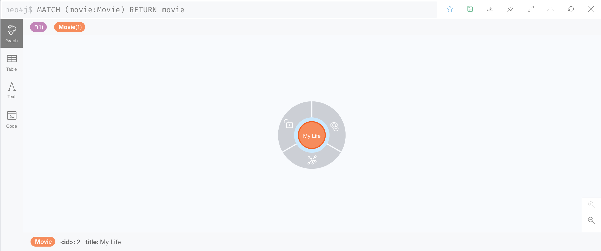

# Quick Start

If you are not familiar with Liquibase concepts, please start [here](https://docs.liquibase.com/concepts/home.html).

## Setup

The rest of this tutorial will assume a CLI installation, as well as a running Neo4j database.
Please refer to the [download section](../download) to install the extension.

There are several ways to install Neo4j:

- in the cloud ☁️ with [Neo4j AuraDB](https://neo4j.com/cloud/platform/aura-graph-database/)
- in the cloud ☁️ with [Neo4j Sandbox](https://sandbox.neo4j.com/)
- locally 🏠 with [Neo4j Desktop](https://neo4j.com/download/)
- locally 🏠 with [Docker](https://hub.docker.com/_/neo4j)

From now on, the tutorial assumes Neo4j runs at the URI `bolt://localhost`, with the user `neo4j` and the very (not)
secure password `changeme`.

## Change Log

The rest of the tutorial assumes the change log is written in the XML file `changeLog.xml`, here are some of the
[supported formats](https://docs.liquibase.com/concepts/changelogs/changelog-formats.html):

=== "changeLog.xml"
    
    ```xml
    <?xml version="1.0" encoding="UTF-8"?>
    <databaseChangeLog xmlns:xsi="http://www.w3.org/2001/XMLSchema-instance"
                       xmlns="http://www.liquibase.org/xml/ns/dbchangelog"
                       xmlns:neo4j="http://www.liquibase.org/xml/ns/dbchangelog-ext"
                       xsi:schemaLocation="http://www.liquibase.org/xml/ns/dbchangelog http://www.liquibase.org/xml/ns/dbchangelog/dbchangelog-latest.xsd">
    
        <changeSet id="my-movie-init" author="fbiville">
            <neo4j:cypher>CREATE (:Movie {title: 'My Life'})</neo4j:cypher>
        </changeSet>
    </databaseChangeLog>
    ```

=== "changeLog.cypher"

    ```cypher
    --liquibase formatted cypher
    --changeset fbiville:my-movie-init
    CREATE (:Movie {title: 'My Life'})
    ```

=== "changeLog.json"

    ```json
    {"databaseChangeLog": [
        {"changeSet": {
            "id": "my-movie-init",
            "author": "fbiville",
            "changes": [
                {"cypher": "CREATE (:Movie {title: 'My Life', genre: 'Comedy'})"}
            ]
        }}
    ]}
    ```

=== "changeLog.yaml"

    ```yaml
    databaseChangeLog:
    - changeSet:
      id: my-movie-init
      author: fbiville
      changes:
      - cypher: 'CREATE (:Movie {title: ''My Life'', genre: ''Comedy''})'
    ```

This creates a node with the label `Movie` and one property, whose key is `title` and valued with the string `My Life`.

!!! tip
    If you are not familiar with these graph concepts, learn more [here](https://neo4j.com/docs/getting-started/current/graphdb-concepts/).

## Dry Run

This is the `updateSQL` command (a less RDBMS-centric name is [under consideration]({{ github_repo }}/issues/159)).
Executing a dry run is a good way to detect errors early, before the changes are persisted to the database.
This displays all the queries that would be executed against Neo4j if it were a normal execution.

```shell
liquibase --url jdbc:neo4j:bolt://localhost \
          --username neo4j \
          --password changeme \
          --changeLogFile changeLog.xml \
          updateSQL
```

The (truncated) output looks like:
```
Liquibase Community {{ liquibase_version }} by Datical
####################################################
##   _     _             _ _                      ##
##  | |   (_)           (_) |                     ##
##  | |    _  __ _ _   _ _| |__   __ _ ___  ___   ##
##  | |   | |/ _` | | | | | '_ \ / _` / __|/ _ \  ##
##  | |___| | (_| | |_| | | |_) | (_| \__ \  __/  ##
##  \_____/_|\__, |\__,_|_|_.__/ \__,_|___/\___|  ##
##              | |                               ##
##              |_|                               ##
##                                                ##
##  Get documentation at docs.liquibase.com       ##
##  Get certified courses at learn.liquibase.com  ##
##  Free schema change activity reports at        ##
##      https://hub.liquibase.com                 ##
##                                                ##
####################################################
Starting Liquibase (version {{ liquibase_version }})
-- *********************************************************************
-- Update Database Script
-- *********************************************************************
-- Change Log: changeLog.xml
-- Against: neo4j@jdbc:neo4j:bolt://localhost
-- Liquibase version: {{ liquibase_version }}
-- *********************************************************************

[...]

-- Changeset changeLog.xml::my-movie-init::fbiville
CREATE (:Movie {title: 'My Life'});

[...]

Liquibase command 'updateSQL' was executed successfully.
```

## Run

This is the `update` command.

```shell
liquibase --url jdbc:neo4j:bolt://localhost \
          --username neo4j \
          --password changeme \
          --changeLogFile changeLog.xml \
          update
```

The output should be similar to:
```
Liquibase Community {{ liquibase_version }} by Datical
####################################################
##   _     _             _ _                      ##
##  | |   (_)           (_) |                     ##
##  | |    _  __ _ _   _ _| |__   __ _ ___  ___   ##
##  | |   | |/ _` | | | | | '_ \ / _` / __|/ _ \  ##
##  | |___| | (_| | |_| | | |_) | (_| \__ \  __/  ##
##  \_____/_|\__, |\__,_|_|_.__/ \__,_|___/\___|  ##
##              | |                               ##
##              |_|                               ##
##                                                ##
##  Get documentation at docs.liquibase.com       ##
##  Get certified courses at learn.liquibase.com  ##
##  Free schema change activity reports at        ##
##      https://hub.liquibase.com                 ##
##                                                ##
####################################################
Starting Liquibase (version {{ liquibase_version }})
Liquibase: Update has been successful.
```

Look at the database and check whether the `Movie` node has been created.

Depending on your Neo4j setup, opening the Neo4j Browser will consist in either:

- going to [Neo4j Aura](https://console.neo4j.io), locating your instance and clicking on the "Open with" button and selecting Neo4j Browser
- going to [Neo4j Sandbox](https://sandbox.neo4j.com/), locating your instance and clicking on the "Open" button
- directly browsing [http://localhost:7474](http://localhost:7474) (Docker)
- opening Neo4j Desktop, selecting your project and clicking on the "Open" button

Once Neo4j browser is open, you can run the `MATCH (movie:Movie) RETURN movie` query, and you should see the same result as below:




What happens if the same `update` command runs again?

Let us find out:

```shell
liquibase --url jdbc:neo4j:bolt://localhost \
          --username neo4j \
          --password changeme \
          --changeLogFile changeLog.xml \
          update
```

The output should be similar to:
```
Liquibase Community {{ liquibase_version }} by Datical
####################################################
##   _     _             _ _                      ##
##  | |   (_)           (_) |                     ##
##  | |    _  __ _ _   _ _| |__   __ _ ___  ___   ##
##  | |   | |/ _` | | | | | '_ \ / _` / __|/ _ \  ##
##  | |___| | (_| | |_| | | |_) | (_| \__ \  __/  ##
##  \_____/_|\__, |\__,_|_|_.__/ \__,_|___/\___|  ##
##              | |                               ##
##              |_|                               ##
##                                                ##
##  Get documentation at docs.liquibase.com       ##
##  Get certified courses at learn.liquibase.com  ##
##  Free schema change activity reports at        ##
##      https://hub.liquibase.com                 ##
##                                                ##
####################################################
Starting Liquibase (version {{ liquibase_version }})
Liquibase: Update has been successful.
```

Look at the database again.


Nothing changed!

It actually works by design. Indeed, change sets are incremental by default, i.e. they run only once.

The database actually contains more than 1 node:


The plugin stores the **change log history** into the same database.
That is how Liquibase remembers not to re-run an incremental change set.

Avid readers may also have noticed a `checkSum` attribute on the `__LiquibaseChangeSet` node.
That attribute makes sure its change set has not changed since the last run.

Learn more by reading the [reference documentation](../reference-intro).


{! include-markdown 'includes/_abbreviations.md' !}
